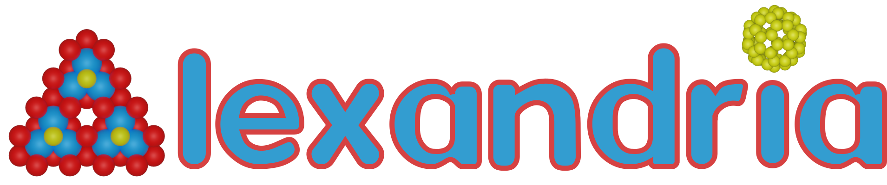

# 🎉 PsiCrawler

<p align="center">
  <a href="./README.md">English</a> |
  <a href="./README_zh.md">简体中文</a>
</p>

## 🚀 Project Overview

PsiCrawler is a research data crawling, normalization, storage, and retrieval project. It is designed to batch collect publicly accessible DFT calculation databases, paper databases, scientific datasets, and related experimental records from the open web.

## 🔥 Latest Updates

- 2026-09-23 Added an AMCSD (American Mineralogist Crystal Structure Database) adapter with official bulk CIF/AMC/DIF archive ingestion, experimental mineral crystal structures normalized into the DFT contract, and SQLite indexing.
- 2026-09-18 Added a NOMAD Archive adapter with native API entry enumeration, per-entry processed archive ingestion, bulk zip ingestion, SI-to-standard unit conversion, normalized DFT records, and SQLite indexing.
- 2026-09-16 Added a Materials Cloud adapter with OPTIMADE paging for MC3D (PBE/PBEsol) and MC2D, curated archive bulk downloads, normalized DFT records, and SQLite indexing.
- 2026-09-13 Added an Alexandria (AMD) adapter with streamed bulk JSON.bz2 ingestion, OPTIMADE on-demand queries, dataset-namespaced identifiers, normalized DFT records, and SQLite indexing.
- 2026-09-10 Added a schema-driven Materials Project adapter with source-specific API access, 26 material routes, complete Summary capture, route-specific queries, CIF export, normalized records, and SQLite indexing.
- 2026-09-10 Added an AFLOW adapter with categorized raw storage, normalized DFT records, property-path tracking, and SQLite indexing.
- 2026-09-10 AFLOW XZ artifacts are decompressed into their original directories after download, and the compressed files are removed after successful conversion.
- 2026-09-10 Downloaded data is stored locally under `data/` and excluded from Git.
- 2026-09-10 Added single-record and batch crawling entrypoints for Materials Project.

## 🌟 Quick Start

Install the dependencies:

```powershell
pip install -r requirements.txt
```

Configure the Materials Project API key:

```powershell
Copy-Item .env.example .env
```

Edit `.env` and set `MP_API_KEY`, then run a single-material download:

```powershell
python -m crawler.dft.mp.run_single mp-149
```

Run a batch download:

```powershell
python -m crawler.dft.mp.run_batch --mp-ids mp-149,mp-13,mp-22526 --sleep 1
```

## 📚 Data Sources

### 🧪 DFT Databases

DFT sources are implemented separately because each database has different APIs, material identifiers, document models, fields, pagination rules, and data licenses.

Overview: [DFT Sources](./document/dft/overview.md)

The unified DFT field definitions, categories, units, enum values, and null-value conventions are documented in the shared contract [`normalizers/dft/standard.yaml`](./normalizers/dft/standard.yaml).

#### Materials Project


Materials Project is a large computational materials database for crystal structures, thermodynamic properties, electronic structure, magnetic and mechanical properties, synthesis information, provenance, and related materials metadata.

Official website: [materialsproject.org](https://materialsproject.org/)

Local Source: [Materials Project](./document/dft/mp.md)

#### AFLOW


AFLOW provides high-throughput computational materials data, including structural, thermodynamic, electronic, magnetic, elastic, and related calculation outputs.

Official website: [aflow.org](https://aflow.org/)

Local Source: [AFLOW](./document/dft/aflow.md)

#### Alexandria (AMD)



Alexandria is an open high-throughput database of DFT-relaxed inorganic crystals, with PBE, PBEsol, and SCAN geometries, convex hulls, phonons, benchmarks, and the generative models trained on them. The adapter streams the bulk `*.json.bz2` archives entry by entry and can also query the OPTIMADE API on demand.

Official website: [alexandria.icams.rub.de](https://alexandria.icams.rub.de/)

Local Source: [Alexandria](./document/dft/alexandria.md)

#### Materials Cloud


Materials Cloud is an open-science platform hosting curated computational materials databases, including the 3D structure database (MC3D) and the 2D database (MC2D). The adapter pages their OPTIMADE APIs and can preserve the curated archive bulk artifacts.

Official website: [materialscloud.org](https://www.materialscloud.org/)

Local Source: [Materials Cloud](./document/dft/materialscloud.md)

#### NOMAD Archive

NOMAD is an open FAIR data platform whose public Archive aggregates processed computational results from many codes and mirrors external databases such as AFLOW. The adapter enumerates public entries through the native API, fetches each processed archive document (or a bulk zip), converts SI units into the standard contract, and indexes normalized DFT records.

Official website: [nomad-lab.eu](https://nomad-lab.eu/)

Local Source: [NOMAD Archive](./document/dft/nomad.md)

#### AMCSD


The American Mineralogist Crystal Structure Database (AMCSD) is an experimental crystal structure database focused on minerals and solids of interest to mineralogists, published by the RRUFF project. The adapter ingests the official bulk CIF, AMC, and DIF archives, aligns records by AMCSD identifier, and normalizes them as experimental structures.

Official website: [rruff.net/amcsd](https://www.rruff.net/amcsd/)

Local Source: [AMCSD](./document/dft/amcsd.md)

#### OQMD

OQMD provides computed materials properties for inorganic compounds, with a focus on formation energies, phase stability, structures, and composition-based search.

Official website: [oqmd.org](https://oqmd.org/)

Local Source: [OQMD](./document/dft/oqmd.md)

---

### 📝 Paper Databases

Paper sources are also implemented separately because each service exposes different metadata, identifiers, citation relationships, full-text links, access rules, and rate limits.

Overview: [Paper Sources](./document/papers/overview.md)

#### arXiv

arXiv provides open-access preprint metadata and links for papers across physics, mathematics, computer science, quantitative biology, and related fields.

Official website: [arxiv.org](https://arxiv.org/)

Local Source: [arXiv](./document/papers/arxiv.md)

#### Crossref

Crossref provides DOI-centered scholarly metadata, including titles, authors, publishers, journals, publication dates, references, and related identifiers.

Official website: [crossref.org](https://www.crossref.org/)

Local Source: [Crossref](./document/papers/crossref.md)

#### OpenAlex

OpenAlex provides open scholarly metadata for works, authors, institutions, venues, concepts, citations, and open-access links.

Official website: [openalex.org](https://openalex.org/)

Local Source: [OpenAlex](./document/papers/openalex.md)

## ⚖️ Compliance

PsiCrawler is intended only for public web pages, public APIs, and openly accessible data resources. Users should follow the target site's terms of service, copyright policy, data license, citation requirements, robots.txt rules, rate limits, and applicable laws.
