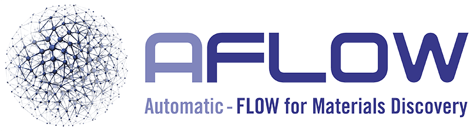

# 🎉 PsiCrawler

<p align="center">
  <a href="./README.md">English</a> |
  <a href="./README_zh.md">简体中文</a>
</p>

## 🚀 项目概览

PsiCrawler 是一个用于科研数据采集、标准化、存储和检索的项目，面向公开网络上的 DFT 计算数据库、论文数据库、科学数据集以及相关实验记录进行批量采集。

每个数据库和论文来源都独立实现，因为不同来源具有不同的 API、材料标识符、文档模型、字段、分页方式和存储格式。项目通过共享 schema 对可比较字段进行统一标准化。

## 🔥 最新进展

- 2026-09-10：新增基于 schema 驱动的 Materials Project 适配器，支持数据源专用 API、26 个材料接口、完整 Summary 字段采集、按接口查询、CIF 导出、标准化记录和 SQLite 索引。
- 新增 Materials Project 单条和批量爬取入口。
- 下载数据保存在 `data/` 目录中，并已从 Git 跟踪中排除。

## 🌟 快速开始

安装依赖：

```powershell
pip install -r requirements.txt
```

配置 Materials Project API 密钥：

```powershell
Copy-Item .env.example .env
```

编辑 `.env` 并设置 `MP_API_KEY`，然后下载单个材料：

```powershell
python -m crawler.dft.mp.run_single mp-149
```

批量下载：

```powershell
python -m crawler.dft.mp.run_batch --mp-ids mp-149,mp-13,mp-22526 --sleep 1
```

`.env` 文件和下载数据均已被 Git 忽略，不应提交到仓库。

## 📚 数据源

### 🧪 DFT 数据库

不同 DFT 数据库具有不同的 API、材料标识符、文档模型、字段、分页规则和数据许可，因此各数据源分别实现。

概览：[DFT 数据源](./sources/dft/README.md)

统一 DFT 字段、字段分类、单位、枚举值和空值约定见：[DFT Databases 标准字段说明](./schemas/dft/README_zh.md)。

#### Materials Project 

Materials Project 是大型计算材料数据库，提供晶体结构、热力学性质、电子结构、磁性和力学性质、合成信息、数据来源以及相关材料元数据。

官方网站：[materialsproject.org](https://materialsproject.org/)

本地数据源说明：[Materials Project README](./sources/dft/mp/README.md)

#### AFLOW



AFLOW 提供高通量计算材料数据，包括结构、热力学、电子、磁性、弹性以及其他相关计算输出。

官方网站：[aflow.org](https://aflow.org/)

本地数据源说明：[AFLOW README](./sources/dft/aflow/README.md)

#### OQMD

OQMD 提供无机化合物的计算材料性质，重点包括形成能、相稳定性、结构和基于组成的检索。

官方网站：[oqmd.org](https://oqmd.org/)

本地数据源说明：[OQMD README](./sources/dft/oqmd/README.md)

---

### 📝 论文数据库

不同论文服务提供不同的元数据、标识符、引用关系、全文链接、访问规则和速率限制，因此论文来源也分别实现。

概览：[论文数据源](./sources/papers/README.md)

#### arXiv

arXiv 提供物理、数学、计算机科学、定量生物学及相关领域论文的开放预印本元数据和链接。

官方网站：[arxiv.org](https://arxiv.org/)

本地数据源说明：[arXiv README](./sources/papers/arxiv/README.md)

#### Crossref

Crossref 提供以 DOI 为中心的学术元数据，包括标题、作者、出版商、期刊、发表日期、参考文献和相关标识符。

官方网站：[crossref.org](https://www.crossref.org/)

本地数据源说明：[Crossref README](./sources/papers/crossref/README.md)

#### OpenAlex

OpenAlex 提供开放的学术元数据，包括论文、作者、机构、出版物、概念、引用关系和开放获取链接。

官方网站：[openalex.org](https://openalex.org/)

本地数据源说明：[OpenAlex README](./sources/papers/openalex/README.md)

## ⚖️ 合规说明

PsiCrawler 仅用于公开网页、公开 API 和开放获取的数据资源。使用者应遵守目标网站的服务条款、版权政策、数据许可、引用要求、robots.txt 规则、速率限制以及适用法律法规。

